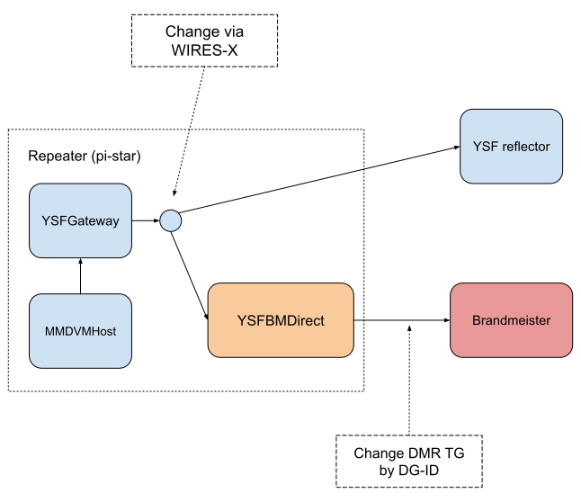

# YSFBMDirect in WPSD

YSFBMDirect is a software that allows you to access Brandmeister as if it were a YSF reflector.
It works by using the YSF Direct protocol that is being currently experimented.

The goal of this software is to build a YSF repeater that can connect to Brandmeister Talk Groups, 
without losing the possibility to connect to other YSF rooms.

By adding YSFBMDirect to your `YSFHosts.txt` file, you can connect to it through WIRES-X.
Then, exit from the WIRES-X mode and simply change the TX DG-ID of your radio to change the DMR Talk Group.

When you make a short transmission just to change the Talk Group, it won't be sent to Brandmeister. 
YSFBMDirect will acknowledge change with a short transmission, showing the Talk Group number as the callsign.



# Installation

### Automatic installation on pi-star

Go to your pi-star dashboard, Configuration > Expert > SSH Access, then login with your credentials 
(user `pi-star` and password `raspberry` by default).

Paste the following command

```commandline
curl https://raw.githubusercontent.com/DaveSMBit/YSFBMDirect/master/install.sh | bash -
```

You can edit your configuration file during the installation wizard, or later with

```commandline
rpi-rw && sudo nano /opt/YSFBMDirect/YSFBMDirect.conf
```

Here's a [video](https://www.youtube.com/watch?v=_kqUQTMxKBU) showing the process.


### Manual Installation (expert)

Clone the repository and create your configuration file. Set your callsign and password in the file.

```
git clone https://github.com/stefanolande/YSFBMDirect.git
cp YSFBMDirect/YSFBMDirect.conf.example YSFBMDirect/YSFBMDirect.conf
nano YSFBMDirect/YSFBMDirect.conf
```

Install the service 

```
mv YSFBMDirect /opt/
cd /opt/YSFBMDirect/
cp ysfbmdirect.service /etc/systemd/system/
sudo systemctl daemon-reload
sudo systemctl enable ysfbmdirect.service
sudo systemctl start ysfbmdirect.service
```

Add YSFBMDirect as a YSF reflector

```
echo "01234;YSF-BM;YSF-BM;127.0.0.1;42002;001" >> /root/YSFHosts.txt
/usr/local/sbin/HostFilesUpdate.sh
```

`01234` is the YSF Room code, `YSF-BM` is the room name and can be changed as you wish (use a free room number).

`42002` is the port used to communicate with YSFBMDirect. You can change it in the configuration file (`ysf_port`).

## Configuration of available Talk Groups

Each line of  the section `[DGID-TO-TG]` of `YSFBMDirect.conf` is in the format `DG-ID: TalkGroup`.
Example: `31: 2231` sets the DG-ID 31 to set the gateway to the Talk Group 2231.

You can add as many mapping as you wish with the 99 available DG-IDs (00-99). 
Pay attention that you cannot repeat DG-IDs and you cannot assign the same TG to multiple DG-IDs.

## Additional configuration

### Back to default Talk group
If you set `back_to_default_time: n`, after n minutes without an incoming transmission, the default Talk Group will be set.

Use `back_to_default_time: 0` if you want to disable this feature, and the Talk group will remain the same unless changed by a user.

### Show the currenct DG-ID with the callsign
If you set `show_dgid_callsign: true`, the callsign of an incoming transmission will include the current DG-ID, for example `91/N1ABC`. 
It is useful to remember the Talk Group you are currently on.

### Silence period before Talk Group change
If you set `tg_change_silence_period: n` with `n` greather than 0, a user can only change the Talk Group after `n` seconds of silence have passed since the last transmission.
In this interval, any transmission will be sent to the current Talk Group, even if the DG-ID is different.

## Acknowledgements

* Stefano IS0EIR: Author
* Bruno IS0GQX: Feature advisor and tester
* Luca IS0GVH: Code reviews

We also thank [Antonio IU5JAE](https://github.com/iu5jae/), whose open-source code was extermely useful for this project. 
